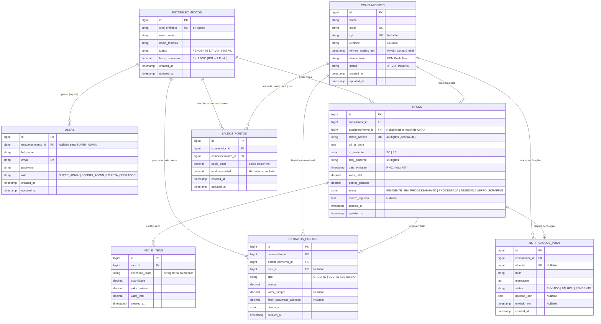

# Modelagem do Banco de Dados - Cash-Me API

Este documento especifica a modelagem relacional do banco de dados PostgreSQL para o sistema **Cash-Me**, atendendo às **Regras de Negócio (RN01 a RN08)**, **Arquitetura Orientada a Eventos (ADR-001)**, **Isolamento Lógico Multi-Tenant (ADR-002)** e a todas as **Tasks (#1 a #9)**.

---

## 1. Diagrama de Entidade e Relacionamento (ERD)

---

## 2. Detalhamento das Tabelas e Estruturas

### 2.1 `estabelecimentos` (Tenants / Lojistas)
Representa as empresas jurídicas parceiras do ecossistema.
- `id` (PK, Serial)
- `cnpj_emitente` (VARCHAR(14), UNIQUE, NOT NULL): CNPJ limpo sem formatação. Índice único para vinculo rápido (RN03).
- `razao_social` (VARCHAR(255), NOT NULL)
- `nome_fantasia` (VARCHAR(255), NOT NULL)
- `status` (VARCHAR(20), NOT NULL, DEFAULT `'PENDENTE'`): Enum (`'PENDENTE'`, `'ATIVO'`, `'INATIVO'`). Novas contas iniciam como `'PENDENTE'` (RN06). Se `'INATIVO'`, cômputo de novos pontos é bloqueado (RN05).
- `fator_conversao` (DECIMAL(10,4), NOT NULL, DEFAULT `1.0000`): Fator de conversão configurável (ex: R$ 1,00 = 1 ponto -> `1.0000`, R$ 10,00 = 1 ponto -> `0.1000`) (RN04 / Task #6).
- `created_at` / `updated_at` (TIMESTAMPTZ)

### 2.2 `users` (Usuários do Painel Admin)
Usuários administrativos do sistema (Super Admin e operadores do Lojista).
- `id` (PK, Serial)
- `estabelecimento_id` (FK -> `estabelecimentos.id`, NULLABLE): `NULL` para usuários da plataforma (`SUPER_ADMIN`). Preenchido para lojistas.
- `full_name` (VARCHAR(255), NULLABLE)
- `email` (VARCHAR(255), UNIQUE, NOT NULL)
- `password` (VARCHAR(255), NOT NULL)
- `role` (VARCHAR(50), NOT NULL, DEFAULT `'LOJISTA_ADMIN'`): (`'SUPER_ADMIN'`, `'LOJISTA_ADMIN'`, `'LOJISTA_OPERADOR'`).
- `created_at` / `updated_at` (TIMESTAMPTZ)

### 2.3 `consumidores` (Conta Global do Consumidor)
Conta unificada dos clientes finais no App Mobile (Glossário: Conta Global / Task #2).
- `id` (PK, Serial)
- `nome` (VARCHAR(255), NOT NULL)
- `email` (VARCHAR(255), UNIQUE, NOT NULL)
- `cpf` (VARCHAR(11), UNIQUE, NULLABLE)
- `telefone` (VARCHAR(20), NULLABLE)
- `termos_aceitos_em` (TIMESTAMPTZ, NOT NULL): Registro de aceite dos Termos Globais.
- `device_token` (VARCHAR(255), NULLABLE): Token do Firebase (FCM) para Notificações Push (Task #9).
- `status` (VARCHAR(20), NOT NULL, DEFAULT `'ATIVO'`): (`'ATIVO'`, `'INATIVO'`).
- `created_at` / `updated_at` (TIMESTAMPTZ)

### 2.4 `nfces` (Notas Fiscais Processadas)
Armazena a tentativa e o resultado da leitura da NFC-e (Tasks #3 e #4).
- `id` (PK, Serial)
- `consumidor_id` (FK -> `consumidores.id`, NOT NULL)
- `estabelecimento_id` (FK -> `estabelecimentos.id`, NULLABLE): Preenchido após identificação do lojista via CNPJ.
- `chave_acesso` (VARCHAR(44), UNIQUE, NOT NULL): Chave de 44 dígitos da SEFAZ (RN02 - Anti-Fraude).
- `url_qr_code` (TEXT, NOT NULL)
- `uf_emitente` (VARCHAR(2), NOT NULL): Restrição SC ou PR (RN07).
- `cnpj_emitente` (VARCHAR(14), NOT NULL): CNPJ extraído do QR Code ou Scraping.
- `data_emissao` (TIMESTAMPTZ, NOT NULL): Validação de até 48 horas (RN01).
- `valor_total` (DECIMAL(10,2), NULLABLE)
- `pontos_gerados` (DECIMAL(10,2), NULLABLE)
- `status` (VARCHAR(30), NOT NULL, DEFAULT `'PENDENTE'`): (`'PENDENTE'`, `'EM_PROCESSAMENTO'`, `'PROCESSADA'`, `'REJEITADA'`, `'ERRO_SCRAPING'`).
- `motivo_rejeicao` (TEXT, NULLABLE): Motivo em caso de erro ou rejeição (ex: `'EXPIRADO_48H'`, `'FORA_ESTADO_ALVO'`, `'LOJISTA_INATIVO'`, `'CHAVE_DUPLICADA'`).
- `created_at` / `updated_at` (TIMESTAMPTZ)

### 2.5 `nfce_itens` (Itens Extraídos da Nota)
Itens individuais extraídos da NFC-e durante o scraping.
- `id` (PK, Serial)
- `nfce_id` (FK -> `nfces.id` ON DELETE CASCADE, NOT NULL)
- `descricao_bruta` (VARCHAR(255), NOT NULL): String bruta do produto (Glossário).
- `quantidade` (DECIMAL(10,3), NOT NULL)
- `valor_unitario` (DECIMAL(10,2), NOT NULL)
- `valor_total` (DECIMAL(10,2), NOT NULL)
- `created_at` (TIMESTAMPTZ)

### 2.6 `saldos_pontos` (Saldo Histórico Multi-Tenant por Estabelecimento)
Saldo consolidado de um consumidor em um lojista específico (ADR-002 & RN05 & RN08).
- `id` (PK, Serial)
- `consumidor_id` (FK -> `consumidores.id`, NOT NULL)
- `estabelecimento_id` (FK -> `estabelecimentos.id`, NOT NULL)
- `saldo_atual` (DECIMAL(10,2), NOT NULL, DEFAULT `0.00`)
- `total_acumulado` (DECIMAL(10,2), NOT NULL, DEFAULT `0.00`)
- `created_at` / `updated_at` (TIMESTAMPTZ)
- **Constraint Única:** `UNIQUE (consumidor_id, estabelecimento_id)` — Garante apenas 1 registro de saldo por cliente/tenant.

### 2.7 `extratos_pontos` (Ledger / Histórico de Transações)
Log imutável de movimentações de pontos (Task #5 & RN05).
- `id` (PK, Serial)
- `consumidor_id` (FK -> `consumidores.id`, NOT NULL)
- `estabelecimento_id` (FK -> `estabelecimentos.id`, NOT NULL)
- `nfce_id` (FK -> `nfces.id`, NULLABLE)
- `tipo` (VARCHAR(20), NOT NULL): (`'CREDITO'`, `'DEBITO'`, `'ESTORNO'`).
- `pontos` (DECIMAL(10,2), NOT NULL)
- `valor_compra` (DECIMAL(10,2), NULLABLE)
- `fator_conversao_aplicado` (DECIMAL(10,4), NULLABLE)
- `descricao` (VARCHAR(255), NOT NULL)
- `created_at` (TIMESTAMPTZ)

### 2.8 `notificacoes_push` (Registro de Notificações Transacionais)
Histórico de notificações push via FCM (Task #9).
- `id` (PK, Serial)
- `consumidor_id` (FK -> `consumidores.id`, NOT NULL)
- `nfce_id` (FK -> `nfces.id`, NULLABLE)
- `titulo` (VARCHAR(255), NOT NULL)
- `mensagem` (TEXT, NOT NULL)
- `status` (VARCHAR(20), NOT NULL, DEFAULT `'PENDENTE'`): (`'ENVIADO'`, `'FALHOU'`, `'PENDENTE'`).
- `payload_json` (JSON, NULLABLE)
- `enviado_em` (TIMESTAMPTZ, NULLABLE)
- `created_at` (TIMESTAMPTZ)

---

## 3. Mapeamento das Regras de Negócio e Tasks

| Código | Descrição da Regra / Task | Solução de Modelagem de Banco |
| :--- | :--- | :--- |
| **Task #1 & RN06** | Onboarding de Lojistas | `estabelecimentos.status` inicia em `'PENDENTE'`. Rota super-admin altera para `'ATIVO'`. |
| **Task #2** | Cadastro Global Consumidor | Tabela `consumidores` desacoplada de lojistas com `termos_aceitos_em`. |
| **Task #3 & RN01 & RN02 & RN07** | QR Code, 48h, SC/PR, Anti-fraude | `nfces.chave_acesso` possui `UNIQUE INDEX`. `nfces.data_emissao` e `uf_emitente` validados. |
| **Task #4** | Scraping Assíncrono SEFAZ | Status da `nfces` em ciclo de vida (`PENDENTE` -> `EM_PROCESSAMENTO` -> `PROCESSADA`). Itens em `nfce_itens`. |
| **Task #5 & ADR-002** | Motor de Pontos & Multi-Tenant | `saldos_pontos` e `extratos_pontos` isolados obrigatoriamente por `estabelecimento_id` + `consumidor_id`. |
| **Task #6 & RN04** | Regra de Cômputo Personalizável | `estabelecimentos.fator_conversao` armazena a regra do lojista; `extratos_pontos.fator_conversao_aplicado` registra o fator no momento da transação. |
| **Task #7 & RN05** | Inadimplência e Direito Adquirido | Se `estabelecimentos.status = 'INATIVO'`, cômputo na `nfces` é rejeitado (`motivo_rejeicao = 'LOJISTA_INATIVO'`), mas `saldos_pontos` permanece intocado. |
| **Task #8 & RN08** | Dashboard Lojista & Privacidade | Consultas do lojista filtram `consumidores` via `JOIN saldos_pontos WHERE saldos_pontos.estabelecimento_id = :tenantId`. |
| **Task #9 & ADR-001** | Push Notification FCM | `consumidores.device_token` armazena o token e `notificacoes_push` armazena o histórico do disparo. |

---

## 4. Índices para Otimização de Performance

1. **Anti-Fraude (RN02):** `CREATE UNIQUE INDEX idx_nfces_chave_acesso ON nfces(chave_acesso);`
2. **Match de Lojista (RN03):** `CREATE UNIQUE INDEX idx_estabelecimentos_cnpj ON estabelecimentos(cnpj_emitente);`
3. **Isolamento Multi-Tenant (ADR-002 & RN08):** `CREATE UNIQUE INDEX idx_saldos_pontos_consumidor_tenant ON saldos_pontos(consumidor_id, estabelecimento_id);`
4. **Filtro de Extrato por Tenant:** `CREATE INDEX idx_extratos_tenant_consumidor ON extratos_pontos(estabelecimento_id, consumidor_id);`
5. **Busca de NF-e por Status/Data:** `CREATE INDEX idx_nfces_status_data ON nfces(status, created_at);`
