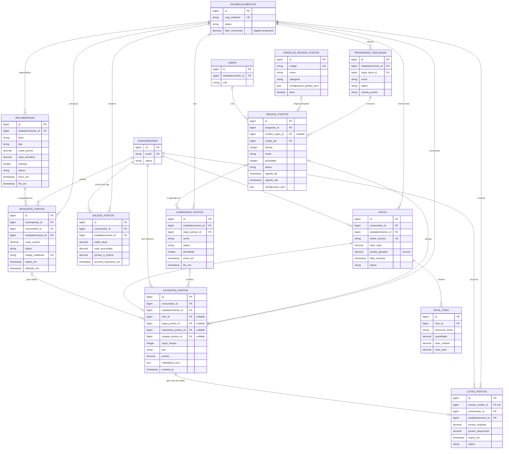

# Sistema de Pontos e Regras Personalizáveis

Manter o **extrato de pontos como razão imutável** e o saldo por consumidor/estabelecimento como uma projeção rápida desse extrato. As regras de pontuação não devem ficar somente em `estabelecimentos.fator_conversao`: cada alteração precisa criar uma **versão de regra**, preservada junto ao lançamento que ela calculou.

Isso permite que cada estabelecimento personalize sua fidelidade sem reescrever o histórico, evita que uma alteração futura recalcule compras passadas e mantém o isolamento multi-tenant definido para o Cash Me.

O escopo inicial pode usar apenas compras oriundas de NFC-e, que é o fluxo já documentado. O modelo, porém, já suporta campanhas, pontuação por item e resgates pelo caixa/QR Code quando essas frentes forem implementadas.

## Princípios de domínio

- Pontos pertencem ao par **consumidor + estabelecimento**; nunca são compartilhados entre lojas no MVP.
- `extratos_pontos` é a fonte auditável da verdade. Um crédito, débito, estorno ou expiração gera uma nova linha; lançamentos anteriores não são editados ou apagados.
- `saldos_pontos` é atualizado na mesma transação do extrato e serve apenas para leitura rápida. Deve ser possível reconstruí-lo a partir do extrato.
- A regra usada em uma transação é congelada no momento do processamento. Mudanças de configuração só afetam notas emitidas/processadas após sua vigência.
- O motor de regras executa exclusivamente no backend. O painel pode simular o resultado, mas não informa a pontuação final.
- Toda consulta e gravação de regras, saldos, extratos, campanhas e resgates exige `estabelecimento_id` no contexto autenticado.

## Modelo de dados proposto



As tabelas existentes `saldos_pontos`, `extratos_pontos`, `nfces` e `nfce_itens` continuam sendo a base. A evolução abaixo substitui gradualmente a configuração única `estabelecimentos.fator_conversao` por uma configuração versionada.

| Entidade | Campos principais | Responsabilidade |
| --- | --- | --- |
| `programas_fidelidade` | `id`, `estabelecimento_id`, `nome`, `status`, `moeda_pontos`, `regra_ativa_id` | Programa do estabelecimento. No MVP, um programa ativo por loja. |
| `modelos_regras_pontos` | `id`, `codigo`, `nome`, `descricao`, `categoria`, `configuracao_padrao_json`, `ativo` | Catálogo global de templates, mantido pela plataforma. Não pertence a um tenant. |
| `regras_pontos` | `id`, `programa_id`, `modelo_regra_id` opcional, `versao`, `nome`, `prioridade`, `status`, `vigente_de`, `vigente_ate`, `configuracao_json`, `criada_por` | Instância editável de uma regra/template em uma loja e sua vigência. |
| `campanhas_pontos` | `id`, `estabelecimento_id`, `nome`, `status`, `inicio_em`, `fim_em`, `prioridade`, `regra_pontos_id` | Agrupa uma ou mais regras promocionais em um período. |
| `recompensas` | `id`, `estabelecimento_id`, `titulo`, `tipo`, `custo_pontos`, `valor_beneficio`, `status`, `inicio_em`, `fim_em`, `estoque` | Opções de troca exibidas na vitrine, como desconto ou produto. |
| `resgates_pontos` | `id`, `recompensa_id`, `consumidor_id`, `estabelecimento_id`, `custo_pontos`, `status`, `codigo_validacao`, `expira_em`, `utilizado_em` | Reserva e consumo de recompensa no caixa. |
| `lotes_pontos` | `id`, `extrato_credito_id`, `consumidor_id`, `estabelecimento_id`, `pontos_originais`, `pontos_disponiveis`, `expira_em`, `status` | Necessário quando houver expiração ou resgate parcial. Permite debitar primeiro os pontos que vencem antes. |

### Ajustes às entidades já documentadas

- `extratos_pontos`: incluir `regra_pontos_id`, `regra_versao`, `campanha_pontos_id` e `metadados_json`. Em um crédito, registrar os valores normalizados que explicam o cálculo: base elegível, multiplicador, arredondamento e identificador da nota. Em um débito, registrar o resgate associado.
- `saldos_pontos`: manter `saldo_atual` e `total_acumulado`; acrescentar, quando a expiração entrar no produto, `pontos_a_expirar` e `proxima_expiracao_em` como projeções dispensáveis/recalculáveis.
- `nfces`: preservar `pontos_gerados`, mas tratá-lo como resumo. A origem definitiva da pontuação é o lançamento de crédito associado à NFC-e.
- `estabelecimentos.fator_conversao`: manter temporariamente para compatibilidade durante a migração. Depois, substituí-lo pela regra ativa do programa; não usá-lo como fonte de cálculo concorrente.

### Restrições e índices essenciais

- `UNIQUE (estabelecimento_id, nome)` para programas, se houver mais de um por loja no futuro.
- `UNIQUE (programa_id, versao)` em `regras_pontos`.
- Índice em `regras_pontos (programa_id, status, vigente_de, vigente_ate, prioridade)` para seleção da regra no cálculo.
- Índice em `extratos_pontos (estabelecimento_id, consumidor_id, created_at)` e em `lotes_pontos (estabelecimento_id, consumidor_id, expira_em)`.
- `UNIQUE (extrato_credito_id)` em `lotes_pontos`, para impedir dois lotes para o mesmo crédito.
- Restrições de valores não negativos para pontos, limites, estoque e valores monetários; datas finais não podem ser anteriores às iniciais.
- A NFC-e já possui chave única global, satisfazendo a idempotência de crédito. O processador também deve rejeitar uma segunda criação de extrato de crédito para a mesma `nfce_id`.

## Formato de uma regra configurável

Usar uma estrutura JSON validada por tipo de template, em vez de uma linguagem livre que seria difícil de testar e proteger. Exemplo de uma regra de acúmulo por valor:

```json
{
  "tipo": "POR_VALOR",
  "reais_base": 1.00,
  "pontos_por_base": 1,
  "arredondamento": "PARA_BAIXO",
  "valor_minimo_compra": 0.00,
  "limite_pontos_por_compra": 500,
  "expiracao": { "modo": "MESES_APOS_CREDITO", "meses": 12 },
  "acumula_com_campanhas": true
}
```

A fórmula base é `floor(valor_elegivel / reais_base) × pontos_por_base`, respeitando o arredondamento e o teto definidos. Para R$ 10 = 1 ponto, usar `reais_base = 10` e `pontos_por_base = 1`; não usar fator decimal para representar a regra na interface administrativa.

O campo `metadados_json` do extrato guarda uma cópia normalizada dos parâmetros efetivamente aplicados. Assim, uma regra na versão 3 pode ser desativada ou alterada sem tornar inexplicável um lançamento anterior.

## Templates iniciais para o lojista

Os templates são ponto de partida: ao selecionar um, o sistema cria uma cópia em `regras_pontos` daquele estabelecimento. Alterar a cópia não modifica o template global nem as regras de outras lojas.

| Template | Configuração sugerida | Caso de uso |
| --- | --- | --- |
| `BASICO_1_POR_REAL` | 1 ponto a cada R$ 1; sem expiração; teto opcional | Lojas que querem uma oferta simples e fácil de comunicar. |
| `ECONOMICO_1_A_CADA_10` | 1 ponto a cada R$ 10; arredonda para baixo | Margem menor ou tíquete médio maior. |
| `BONUS_DE_BOAS_VINDAS` | crédito fixo único após primeira compra elegível | Incentiva cadastro e primeira recorrência. |
| `DOBRO_EM_DATA_ESPECIAL` | multiplicador 2x, período definido, com teto por compra | Aniversário da loja, Black Friday ou aniversário do cliente. |
| `HORA_FELIZ` | multiplicador definido por dias da semana e faixa de horário | Restaurantes, cafés e serviços com horários ociosos. |
| `COMPRE_E_GANHE` | crédito fixo quando a compra atinge valor mínimo | Campanhas como “a partir de R$ 50, ganhe 20 pontos”. |
| `POR_ITEM_ELEGIVEL` | pontos por SKU/categoria ou por descrição normalizada | Fase posterior, depois de melhorar a qualidade dos itens da NFC-e. |
| `PONTOS_COM_VALIDADE` | regra base + expiração em 3, 6 ou 12 meses | Operações que desejam estimular retorno. |

Para o MVP, implementar e expor apenas os quatro primeiros templates. Os demais podem existir no catálogo como indisponíveis até que o motor suporte suas condições; isso evita prometer no painel uma regra que ainda não pode ser apurada pela NFC-e.

## Ordem determinística de aplicação

1. Validar a NFC-e: chave única, janela de 48 horas, UF aceita, extração concluída e CNPJ vinculado.
2. Confirmar que o estabelecimento está `ATIVO`. Se estiver inativo, não criar crédito; saldos e resgates históricos permanecem consultáveis, conforme RN05.
3. Encontrar regras ativas do estabelecimento válidas para a data/hora da compra. Aplicar filtros de elegibilidade: valor mínimo, primeira compra, aniversário e período de campanha.
4. Escolher uma regra base. Se houver mais de uma elegível com a mesma prioridade, bloquear a publicação da configuração até que o conflito seja resolvido.
5. Aplicar campanhas compatíveis na ordem de prioridade. Cada campanha declara se é **cumulativa** (soma/multiplica) ou **exclusiva** (substitui a base); duas exclusivas não podem disputar o mesmo contexto.
6. Aplicar os limites: máximo por compra, máximo por cliente/período e, futuramente, limite de orçamento de campanha.
7. Arredondar somente ao fim de cada regra conforme sua configuração; persistir o detalhe do cálculo, criar um crédito no extrato, atualizar o saldo e criar o lote de pontos em uma única transação de banco.
8. Publicar `PointsAwardedEvent` somente depois do commit para disparar a notificação. Reprocessamentos devem ser idempotentes e não duplicar crédito ou push.

## Regras de resgate e expiração

O painel já prevê conversão de pontos em descontos. Para não permitir saldo negativo ou uso duplo, o fluxo recomendado é:

1. O cliente solicita uma recompensa; o backend bloqueia o saldo/lotes relevantes e cria um resgate `RESERVADO` com código curto e validade curta.
2. O caixa confirma o código; em uma transação única, o resgate passa a `UTILIZADO`, os lotes são consumidos por vencimento mais próximo (FEFO), um débito entra no extrato e o saldo é atualizado.
3. Cancelamento ou expiração da reserva libera os lotes, sem apagar o histórico da tentativa.
4. Um job diário localiza lotes expirados ainda disponíveis, cria lançamento `EXPIRACAO` (ou `DEBITO` com subtipo), zera o lote e atualiza o saldo. O cliente recebe alerta antes do vencimento quando houver consentimento para push.

O tipo atual de extrato deve evoluir para `CREDITO`, `DEBITO_RESERVADO`, `DEBITO`, `ESTORNO`, `EXPIRACAO` e `AJUSTE`. `AJUSTE` exige motivo e usuário administrativo, e deve ser excepcional.

## Personalização segura no painel

O administrador do estabelecimento pode criar rascunhos, simular e publicar regras, mas não editar uma regra já aplicada. Ao salvar uma mudança em regra ativa, o sistema cria a próxima versão e pede uma data/hora de vigência.

Campos que o administrador pode configurar no MVP:

- relação “R$ X = Y pontos”;
- arredondamento e valor mínimo da compra;
- teto de pontos por compra;
- validade dos pontos, inclusive opção de não expirar;
- datas, nome e prioridade de campanhas de bônus;
- recompensas: custo em pontos, valor do desconto, período e estoque.

Validações de experiência e proteção:

- mostrar uma frase humana derivada da regra, por exemplo: “A cada R$ 10, você ganha 1 ponto; máximo de 500 por compra”.
- oferecer simulador com valores de compra e previsão de pontos; o mesmo serviço do backend deve ser usado na simulação e no processamento real.
- impedir períodos sobrepostos para campanhas exclusivas e advertir sobre sobreposição cumulativa.
- limitar valores máximos definidos pela plataforma (por exemplo, multiplicador e teto), para evitar configurações acidentais ou abusivas.
- registrar autor, data, versão anterior, motivo da alteração e publicação/despublicação em uma trilha de auditoria.
- `LOJISTA_OPERADOR` pode visualizar e simular; `LOJISTA_ADMIN` publica regras; `SUPER_ADMIN` mantém templates e limites globais.

## Compatibilidade com a documentação atual

Esta proposta mantém as decisões existentes:

- preserva `saldos_pontos` e `extratos_pontos` separados por `estabelecimento_id` (ADR-002);
- respeita as RN01, RN02, RN03, RN05 e RN07 antes de conceder crédito;
- torna a RN04 mais robusta ao versionar o fator de conversão e registrar a regra aplicada;
- preserva o direito adquirido em caso de inativação do lojista;
- usa o evento `ScrapingCompletedEvent` como entrada e `PointsAwardedEvent` após a concessão, como previsto na arquitetura orientada a eventos.

## Caminho incremental de implementação

1. Entregar o núcleo: programa por loja, regra versionada `POR_VALOR`, crédito idempotente por NFC-e e snapshot no extrato. Migrar o `fator_conversao` atual para a primeira versão da regra ativa.
2. Liberar no painel os quatro templates de MVP, rascunho, simulador e agendamento de vigência. A tela atual de regras deve consumir a frase humana e os limites da regra publicada.
3. Criar campanhas temporárias de multiplicador/valor mínimo, com prioridade e prevenção de conflitos.
4. Implementar recompensas e reserva de resgate antes de permitir conversão real no caixa.
5. Introduzir lotes e expiração somente quando a opção de validade for ativada para uma loja, com avisos ao consumidor e job de expiração.

## Decisões a validar com produto antes da implementação

- Pontos têm casas decimais ou sempre são inteiros? A recomendação é pontos inteiros no MVP.
- Um cliente pode acumular pontos em mais de uma campanha na mesma compra? A recomendação inicial é uma regra base e no máximo uma campanha cumulativa.
- A validade deve contar da data de emissão da NFC-e ou do crédito processado? A recomendação é da emissão da compra, registrada no lote.
- Pontos de estabelecimento inativo poderão ser resgatados? A RN05 exige a manutenção do saldo, mas não define a política de resgate; essa regra precisa ser explicitada.
- Descontos podem ser combinados com promoções do caixa e podem exceder o valor da compra? A recomendação é não combinar por padrão e limitar o benefício ao valor da compra.
